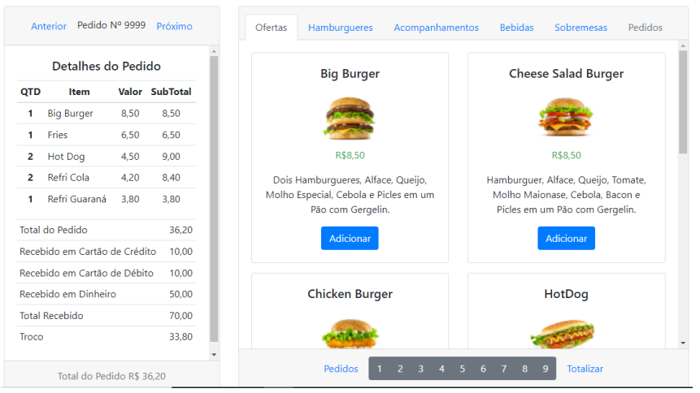

# VueBurguer
### FastFood

Tela operacional para registrar pedidos e cobrança para fast-food.

## Protótipo Modelo de Software – Vue Burguer
Com a finalidade de apresentar a implementação de uma ou mais tecnologias, esta proposta não tem finalidade comercial.

## Descrição Geral
Neste software será utilizada a implementação do desenvolvimento em VueJS. Um painel em HTML desenvolvido com responsividade para uma tela de computador com dimensões de no mínimo 1024x768 pixels. A aplicação será executada em browser que atenda aos requisitos da tecnologia Javascript.
A implementação dos recursos do VueJS neste protótipo está limitada ao uso da CDN incorporada na “HEAD” da página.
A necessidade apresentada para esta proposta de software é exibir produtos característico de fastfood, em um terminal para o atendente da lanchonete registrar o pedido e posteriormente totalizar, cobrar e por fim, consultar os pedidos já efetuados.

## Representação Operacional
Os produtos serão definidos já no desenvolvimento, eliminando a etapa de cadastros. Esta decisão impede a alteração dinâmica do cadastro dos produtos.
A tela apresenta um cardápio de produtos, com sucinta descrição de cada item e seu valor de comercialização. Uma área da tela será reservada para listar os itens selecionados do pedido, bem como, consultar os pedidos anteriores.
Os pedidos finalizados serão mantidos em sessão no navegador. Para efeito didático, nesta versão, não utilizará um banco de dados, ou algum meio de armazenamento dos dados. Ao atualizar o navegador, toda a informação na sessão será reciclada.

<table>
  <tr>
    <td>
      
    </td>
  </tr>
  <tr>
    <td>
      <a href="http://vueburguer.free.nf/" target="_blank">VER Demonstra&ccedil;&atilde;o</a>
    </td>
  </tr>
</table>

## Requisitos de Implementação
Uso com browser compatível com Javascript.

## Cronograma
O desenvolvimento da solução requer o total de 120 horas.

## Suporte ao Produto
Esta proposta não tem valor comercial.

## Condições Gerais
Esta proposta não tem valor comercial, porém, para efeito de validação da entrega do produto, supõe um valor ao desenvolvimento, implantação e suporte.
Considerando o tempo de desenvolvimento de 120 horas;
Total do investimento em R$9.600,00 (Nove mil e seiscentos reais).

## Considerações Finais
O sistema ora proposto é passível de expansão e adaptável às necessidades específicas da área de negócios do cliente. Logomarcas, fotos, ilustrações e textos, são de responsabilidade da contratante, devem ser apresentados dentro das datas negociadas de comum acordo entre as partes, para que possamos cumprir rigorosamente o cronograma de desenvolvimento e consequente entrega do projeto na data programada, constante neste documento.
